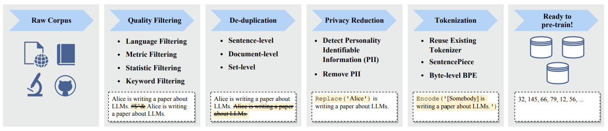

# Preprocessing



_引用: A Survey of Large Language Models, https://arxiv.org/pdf/2303.18223.pdf Fig. 7: An illustration of a typical data preprocessing pipeline for pre-training large language models._

## 環境構築

### condaによる仮想環境の構築
```sh
$ cd ~/

# condaのインストール先ディレクトリを作成。
$ mkdir -p ~/miniconda3/ && cd ~/miniconda3/

# condaをインストール。
$ wget https://repo.anaconda.com/miniconda/Miniconda3-py310_23.10.0-1-Linux-x86_64.sh && bash Miniconda3-py310_23.10.0-1-Linux-x86_64.sh -b -u -p ~/miniconda3/

# インストールしたcondaを有効化。
$ source ~/miniconda3/etc/profile.d/conda.sh

# condaコマンドが使えることを確認。
$ which conda && echo "====" && conda --version

# Python仮想環境を作成。
$ conda create --name .venv_data python=3.11.7 -y

# 作成したPython仮想環境を有効化。
$ conda activate .venv_data

# データ取得、加工の作業ディレクトリへ移動
$ cd ~/ucllm_nedo_dev/data_management

# pythonのライブラリ群をインストール
$ ./bin/setup
```

## 1. Download datasets

### 日本語[C4](https://huggingface.co/allenai/c4)

部分的なダウンロードを行う場合
```sh
$ python -m preprocessing.download_dataset --dataset=c4 --split=train --output_base=tmp/output --index_from=0 --index_to=5
```

全日本語mC4をダウンロードする場合
```sh
$ ./bin/download_mc4_ja tmp/output
```

### [wikipedia dump](https://dumps.wikimedia.org/jawiki/)


```sh
$ python -m preprocessing.download_dataset --dataset=wikipedia --split=20240301
```

splitに指定可能な値は[wikipedia dumpのindex](https://dumps.wikimedia.org/jawiki/)に指定されているディレクトリ


### [Redpajama-1T](https://huggingface.co/datasets/togethercomputer/RedPajama-Data-1T)

全件ダウンロード(※注 巨大なデータセットです。ダウンロード先、実行時間にご注意ください)

```sh
$ python -m preprocessing.download_dataset --dataset=redpajama
```

データセット別のダウンロード

```sh
$ python -m preprocessing.download_dataset --dataset=redpajama --split=c4
```

splitに指定可能なデータセットは以下
- arxiv
- book
- c4
- common_crawl
- github
- stackexchange
- wikipedia

[Github](https://github.com/togethercomputer/RedPajama-Data)にFiltering、Dedupを含めたコードもあるので参考にして下さい

### [Redpajama v2](https://huggingface.co/datasets/togethercomputer/RedPajama-Data-V2)

Redpajamaの後継バージョンです


```sh
$ python -m preprocessing.download_dataset --dataset=redpajama_v2 --snapshot=2023-06 --partition=head_middle --language=en
```

その他ダウンロード可能なスナップショット、パーティション、言語等の詳しい使い方はHugging Faceを参照してください
加工処理用(quality signals、minhash signatures, duplicate ids)のデータセットもダウンロード可能なので同様にサイトを参照してください

## 2. Data processing


### Filtering

フィルタリングを行います。
フィルタリングの目的は文書内の重複排除や、不適切な文を削除することでLLMに学習させる文書の品質を上げることです。
興味のある方はReferencesを参照してください。

デフォルトのフィルタリングの実行

```sh
$ python -m preprocessing.filtering --input_dir=input --output_dir=output
```

自前のフィルターを追加する方法は開発TIPSを参考にしてください。

### Dedup

文書間にわたって重複排除を行います。
重複した文書を排除することによりLLMの性能が上がることが報告されています。
興味のある方はReferencesを参照してください。

```sh
$ python -m preprocessing.dedup --input_dir=input --output_dir=tmp/output
```

### PII Masking

LLMが個人情報を学習しないように個人情報のマスキングを行います。
ここではメールアドレスと電話番号のマスキングしか行っていないため、人名、住所、マイナンバー、パスポート番号などを必要に応じてマスクしてください。

```py
cleaner = Compose([
    document_filters.JSONLoader(),
    document_filters.MaskPersonalInformation(),
    document_filters.JSONDumper(),
])
```

## 3. JSONLファイルのマージ

以下のコマンドで複数のJSONLファイルを1つのJSONLファイルにまとめることができます
学習用のデータセットを作成する時にご利用ください

```sh
$ bin/concat {input_dir} {output_dir}
```

以下のようなディレクトリ構造でファイルが置かれているとします
```
dataset/wikipedia/0.jsonl
dataset/wikipedia/1.jsonl
dataset/wikipedia/2.jsonl
```

このコマンドを利用して1つのファイルにまとめることができます

```sh
$ bin/concat dataset/wikipedia dataset/wikipedia/merged
```

出力されるファイルは以下のとおりです

```
dataset/wikipedia/merged/merged.jsonl
```

## 4. Post Training

### [databricks dolly Japanese](https://huggingface.co/datasets/taka-yayoi/databricks-dolly-15k-ja)

利用方法

```sh
$ python -m posttraining.download_dataset --output_base=output
```

https://huggingface.co/datasets/taka-yayoi/databricks-dolly-15k-ja にアップロードされているJSONL形式のデータセットです
Dollyのトレーニングで利用可能な形式になっているので学習に応じて必要な形に整形して利用してください

#### 参考

https://www.databricks.com/jp/blog/2023/04/12/dolly-first-open-commercially-viable-instruction-tuned-llm

## 開発TIPS

### .jsonlでの保存方法とロード

.jsonlはJSON Lines形式のファイルの拡張子です。
JSONの値をを改行区切りで保存したファイル形式のことを指します。
詳細は[JSON Lines](https://jsonlines.org/)のサイトを確認してください。

jsonlでの保存方法と読込方法のサンプルを以下に記載します。

```py
lines = [
    {"user_id": "1", "name": "Esitio Akjmhka"},
    {"user_id": "2", "name": "Anz Auksyihumofi"},
]

with open(output_file, "w", encoding="utf8") as writer:
    for line in lines:
        json.dump(line, writer, ensure_ascii=False)
        writer.write("\n")

with open(read_file) as f:
    json_lines = f.readlines()

dict_lines = [json.loads(json_line) for json_line in json_lines]
```

### Composeを用いた処理パイプラインの作成

preprocessing/filtering.pyではhojicharを用いているのでフィルターの順序の変更、追加、削除を柔軟に行えます。

```py
cleaner = Compose([
    document_filters.JSONLoader(),
    document_filters.DocumentNormalizer(),
    document_filters.DiscardBBSComments(),
    document_filters.JSONDumper(dump_reason=True),
])

# document_filters.DiscardAds()を追加
cleaner = Compose([
    document_filters.JSONLoader(),
    document_filters.DocumentNormalizer(),
    document_filters.DiscardBBSComments(),
    document_filters.DiscardAds(), # filteringの追加
    document_filters.JSONDumper(dump_reason=True),
])
```

hojicharで用意されているfilteringは[hojicharのコード](https://github.com/HojiChar/HojiChar/blob/v0.9.0/hojichar/filters/document_filters.py)を参照してください。

### カスタムFilteringの追加

hojicharのフィルターを自作してComposeに追加することができます。
以下のコードを参考に自作のフィルターを作成してComposeに追加してください。

- preprocessing/filtering/custom_document_filters.py # 文書のフィルタリング
- preprocessing/filtering/custom_token_filters.py    # トークンのフィルタリング
- preprocessing/filtering/custom_tokenizer.py        # トークナイザー

### dedupのその他の方法

dedup部分を[datasketch](https://github.com/ekzhu/datasketch)で実装することもできる。
バックエンドにRedisやCassandraを用いることができるので、シングルノードに収まらない場合や、メモリにデータが乗り切らない場合に便利。

## References

|Title|URL|概要|
|:--|:--|:--|
|The RefinedWeb Dataset for Falcon LLM: Outperforming Curated Corpora with Web Data, and Web Data Only|https://arxiv.org/pdf/2306.01116.pdf|Falcon LLMの事前学習データ収集加工のパイプラインについて解説|
|AI2 Dolma: 3 Trillion Token Open Corpus for Language Model Pretraining|https://blog.allenai.org/dolma-3-trillion-tokens-open-llm-corpus-9a0ff4b8da64|Dolmaのデータ収集加工のパイプラインについて解説|
|Deduplicating Training Data Makes Language Models Better|https://arxiv.org/pdf/2107.06499.pdf|DedupによってLLMの品質が上がることを報告|
|Data Management For Large Language Models: A Survey|https://arxiv.org/pdf/2312.01700.pdf|LLMのデータ管理に関するサーベイ論文|
