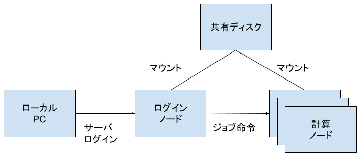

# Infra

## Overview

The job scheduler is [Slurm](https://slurm.schedmd.com/), a common system for Linux clusters. 

The GCP system is made of the following components:

- a login node, where users connect to prepare, launch and monitor the jobs
- a controller node, to manage the scheduler and keep track of the system state. Users do not interact directly with this node.
- worker nodes, where jobs are sent to be executed
- a shared filesystem node, mounted in all nodes so that the /home directory is avaialble from all workers

Nodes are grouped into sets called partitions, so that different nodes can be assigned for different purposes. They functions as job queues, with different resources and priority settings.

Each user is assigned to one or more partitions, and when sending a job the default partition for the user will be used if not set explicitly.

There are many resources online with detailed documentation, the following is only a simplified guide.

### Diagram



## Login

TODO decide if we are going to use the GCP console and OS Login or a conventional SSH server with private keys

## Job Execution

There are two possible modes to run a job, interactive and batch. In interactive mode the shell is connected to the worker and commands can be run directly in the node. In batch mode a script with the commands to run and the resources required is sent to the scheduler, it will be run as soon as enough resources are available.

### Interactive

Runs an interactive session in a compute node.


```shell
$ srun --partition g2 --nodes=1 --gpus-per-node=1 --time=01:00:00 --pty bash -i
```

Common parameters:

- `--partition=g2`, the partition name
- `--nodes=1`, the node count, usually 1 for interactive sessions
- `--gpus-per-node=`, to set number of GPUs to use
- `--time=01:00:00`, to set a time limit (optional)
- `--pty bash -i`, to make it interactive with a bash shell
### Batch

Create a job script to launch in the background:

```bash
#!/bin/bash

# Command line options go here
#SBATCH --partition=g2
#SBATCH --time=00:01:00
#SBATCH --nodes=1
#SBATCH --job-name=example
#SBATCH --output=example.out
#SBATCH --gpus-per-node=1

# Command(s) goes here
nvidia-smi
```

Then send the job to the batch scheduler:

```shell
$ sbatch myjob.sh

Submitted batch job 4
```

### Check status

Check the status of all jobs:

```shell
$ squeue
```

Example output:

```shell
             JOBID PARTITION     NAME     USER ST       TIME  NODES NODELIST(REASON)
                 6        g2  example asolano_  R       0:02      1 mlmini-g2-ghpc-0
```

Or a single job:

```shell
$ squeue --job $JOBID

             JOBID PARTITION     NAME     USER ST       TIME  NODES NODELIST(REASON)
                10        g2  example asolano_ CF       0:06      2 mlmini-g2-ghpc-[0-1]
```

### Cancel a job

Cancel a running job:
```shell
$ scancel $JOBID
```

## Environment preparation

With the NVIDIA driver installed it is possible to set up all the user environment for each project independently with Conda, thus minimizing the use of environment modules.

### Minconda

Download a recent version of the Miniconda installer from the Anaconda website [here](https://docs.anaconda.com/free/miniconda/miniconda-other-installer-links/#linux-installers).

```bash
$ wget https://repo.anaconda.com/miniconda/Miniconda3-py310_23.10.0-1-Linux-x86_64.sh
$ bash Miniconda3-py310_23.10.0-1-Linux-x86_64.sh
```

### Python

To select a specific version of Python for a project specify it when creating the environment:

```bash
$ conda create -n myenv python=3.9
$ conda activate myenv
```

### CUDA Toolkit

To install a complete CUDA toolkit with a specific version, choose from the NVIDIA selection [here](https://anaconda.org/nvidia/cuda-toolkit). For example:

```bash
$ conda install nvidia/label/cuda-11.8.0::cuda-toolkit
```

### PyTorch

Install a specific PyTorch version from the list of previous versions [here](https://pytorch.org/get-started/previous-versions/). It is usually recommended to match the CUDA version. For example:

```bash
$ conda install pytorch==2.2.0 torchvision==0.17.0 torchaudio==2.2.0 pytorch-cuda=11.8 -c pytorch -c nvidia
```

### Activation

This combination of packages sets all the paths for the project automatically, to activate it add the environment loading code to the job script:

```bash
# job.sh

# ...

# Activate the correct conda environment
source ~/miniconda3/etc/profile.d/conda.sh
conda activate myenv

# ...
```
