# Train

## 前提

* 計算環境: GCPプレ環境, 2 node, 16 GPU (Nvidia L4 24GB)
  * 例: `$ srun --partition=a3 --nodes=2 --gpus-per-node=8 --cpus-per-task=208 --pty bash -i`

## Step 0. 環境構築

### Step 0-0. このgitレポジトリのクローン

```sh
$ cd ~/

# 本レポジトリをucllm_nedo_devという名前でクローン。
# https://github.com/matsuolab/ucllm_nedo_prod/pull/6 by https://github.com/awakia
$ git clone https://github.com/matsuolab/ucllm_nedo_prod.git ucllm_nedo_dev

# ~/ucllm_nedo_dev/train以下のファイル一覧が表示されるか確認。
$ ls ~/ucllm_nedo_dev/train/
```

### Step 0-1. Python仮想環境作成前における下準備

```sh
$ cd ~/

# 念のためSSH等が故障したときなどに備えて~/.bashrcをバックアップしておく。
$ cp ~/.bashrc ~/.bashrc.backup

# condaのインストール先ディレクトリを作成。
$ mkdir -p ~/miniconda3/ && cd ~/miniconda3/

# condaをインストール。
$ wget https://repo.anaconda.com/miniconda/Miniconda3-py310_23.10.0-1-Linux-x86_64.sh && bash Miniconda3-py310_23.10.0-1-Linux-x86_64.sh -b -u -p ~/miniconda3/

# インストールしたcondaを有効化。
$ source ~/miniconda3/etc/profile.d/conda.sh

# condaコマンドが使えることを確認。
$ which conda && echo "====" && conda --version
```

### Step 0-2. Python仮想環境の作成

```sh
$ cd ~/ucllm_nedo_dev/train/

# 念のため既に有効化されているPython仮想環境がある場合に備えてリセットのために無効化する。
$ conda deactivate

# Python仮想環境を作成。
$ conda create --name .venv_train python=3.9 -y

# Python仮想環境を有効化した時に自動で環境変数 `$LD_LIBRARY_PATH` を編集するように設定。
$ mkdir -p ~/miniconda3/envs/.venv_train/etc/conda/activate.d && \
    echo 'export ORIGINAL_LD_LIBRARY_PATH=$LD_LIBRARY_PATH' > ~/miniconda3/envs/.venv_train/etc/conda/activate.d/edit_environment_variable.sh && \
    echo 'export LD_LIBRARY_PATH="$HOME/miniconda3/envs/.venv_train/lib:$LD_LIBRARY_PATH"' >> ~/miniconda3/envs/.venv_train/etc/conda/activate.d/edit_environment_variable.sh && \
    chmod +x ~/miniconda3/envs/.venv_train/etc/conda/activate.d/edit_environment_variable.sh

# Python仮想環境を無効化した時に自動で環境変数 `$LD_LIBRARY_PATH` を元に戻すように設定。
$ mkdir -p ~/miniconda3/envs/.venv_train/etc/conda/deactivate.d && \
    echo 'export LD_LIBRARY_PATH=$ORIGINAL_LD_LIBRARY_PATH' > ~/miniconda3/envs/.venv_train/etc/conda/deactivate.d/rollback_environment_variable.sh && \
    echo 'unset ORIGINAL_LD_LIBRARY_PATH' >> ~/miniconda3/envs/.venv_train/etc/conda/deactivate.d/rollback_environment_variable.sh && \
    chmod +x ~/miniconda3/envs/.venv_train/etc/conda/deactivate.d/rollback_environment_variable.sh

# 作成したPython仮想環境を有効化。
# ※無効化するときのコマンドは `$ conda deactivate` 。
$ conda activate .venv_train

# Python仮想環境を有効化した後は (python3コマンドだけでなく) pythonコマンドも使えることを確認。
(.venv_train) $ which python && echo "====" && python --version

# 環境変数 `$PATH` に `$HOME/miniconda3/envs/.venv_train/bin` が含まれていることを確認。
(.venv_train) $ echo $PATH

# 環境変数 `$LD_LIBRARY_PATH` に `$HOME/miniconda3/envs/.venv_train/lib` が含まれていることを確認。
(.venv_train) $ echo $LD_LIBRARY_PATH
```

### Step 0-3. パッケージ等のインストール

```sh
(.venv_train) $ cd ~/ucllm_nedo_dev/train/

# cuda-11.8.0をインストール。
(.venv_train) $ conda install nvidia/label/cuda-11.8.0::cuda-toolkit -y

# PyTorchを指定のバージョンでインストール。
(.venv_train) $ conda install pytorch==2.2.0 torchvision==0.17.0 torchaudio==2.2.0 pytorch-cuda=11.8 -c pytorch -c nvidia -y

# pipを指定のバージョンでインストール。
(.venv_train) $ pip install pip==24.0

# PyTorchを指定のバージョンでインストールした後に、requirements.txtを用いて諸々のパッケージをインストール。
(.venv_train) $ pip install -r ~/ucllm_nedo_dev/train/requirements.txt

# deepspeedの依存パッケージをインストール。
(.venv_train) $ pip install deepspeed-kernels

# deepspeedを指定のバージョンでインストール。このとき、deepspeed関連の拡張機能たち "ops" を事前にビルドしておくために `DS_BUILD_OPS=1` と設定。
# https://www.deepspeed.ai/tutorials/advanced-install/#pre-install-deepspeed-ops
# ※しばらく時間がかかるので注意。
(.venv_train) $ DS_BUILD_OPS=1 DS_BUILD_EVOFORMER_ATTN=0 DS_BUILD_SPARSE_ATTN=0 pip install deepspeed==0.12.4

# deepspeed関連の拡張機能たち "ops" が正しくインストールされていることを確認。
(.venv_train) $ ds_report
```

### Step 0-4. Megatron-DeepSpeedのインストール

```sh
(.venv_train) $ cd ~/ucllm_nedo_dev/train/

# Megatron-DeepSpeedのレポジトリをクローン。
(.venv_train) $ git clone https://github.com/matsuolab/Megatron-DeepSpeed.git

# mainブランチではエラーが起きる場合があるため、指定のタグにチェックアウト。
(.venv_train) $ cd ~/ucllm_nedo_dev/train/Megatron-DeepSpeed/ && git fetch origin && git checkout refs/tags/ucllm_nedo_v20240415.1.0

# Megatron-DeepSpeedをインストール。
(.venv_train) $ cd ~/ucllm_nedo_dev/train/Megatron-DeepSpeed/ && python setup.py install
```

### Step 0-5. apexのインストール

```sh
(.venv_train) $ cd ~/ucllm_nedo_dev/train/

# apexのレポジトリをクローン。
(.venv_train) $ git clone https://github.com/NVIDIA/apex.git

# mainブランチではエラーが起きる場合があるため、指定のタグにチェックアウト。
(.venv_train) $ cd ~/ucllm_nedo_dev/train/apex/ && git fetch origin && git checkout refs/tags/23.08

# nvccが対応しているCUDAのバージョンとPyTorchが依存しているCUDAのバージョンが一致していることを確認。
# https://github.com/matsuolab/ucllm_nedo_prod/pull/5 by https://github.com/awakia
(.venv_train) $ which nvcc && echo "====" && nvcc --version && echo "====" && python -c "import torch; print(f'{torch.version.cuda = }')"

# pipのバージョンが23.1以上であることを確認。
(.venv_train) $ which pip && echo "====" && pip --version

# pipのバージョンが23.1以上の場合のインストール方法で、apexをインストール。
# ※しばらく時間がかかるので注意。
(.venv_train) $ cd ~/ucllm_nedo_dev/train/apex/ && pip install -v --disable-pip-version-check --no-cache-dir --no-build-isolation --config-settings "--build-option=--cpp_ext" --config-settings "--build-option=--cuda_ext" ./

# apexがインストールされていることを確認。
(.venv_train) $ pip list | grep "apex"

# apex_C.cpython-39-x86_64-linux-gnu.soが作成されていることを確認。
(.venv_train) $ find ~/ucllm_nedo_dev/train/apex/build/lib.linux-x86_64-cpython-39/ -name apex_C.cpython-39-x86_64-linux-gnu.so
```

### Step 0-6. Flash Attention 2のインストール

```sh
(.venv_train) $ cd ~/ucllm_nedo_dev/train/

# Flash Attention 2のインストールに必要なninjaを念のため再インストール。
(.venv_train) $ pip uninstall ninja -y && pip install ninja==1.11.1

# Flash Attention 2をインストール。
(.venv_train) $ pip install flash-attn==2.5.0 --no-build-isolation

# Flash Attention 2がインストールされていることを確認。
(.venv_train) $ pip list | grep "flash-attn"
```

### Step 0-7. llm-jp-sftのインストール

```sh
(.venv_train) $ cd ~/ucllm_nedo_dev/train/

# llm-jp-sftのレポジトリをクローン。
(.venv_train) $ git clone https://github.com/matsuolab/llm-jp-sft.git

# mainブランチではエラーが起きる場合があるため、指定のタグにチェックアウト。
(.venv_train) $ cd ~/ucllm_nedo_dev/train/llm-jp-sft/ && git fetch origin && git checkout refs/tags/ucllm_nedo_v20240415.1.0
```

## Step 1. トークナイザーの学習

### Step 1-1. 学習の実行

```sh
(.venv_train) $ cd ~/ucllm_nedo_dev/train/scripts/step1_train_tokenizer/

# 学習スクリプトを実行。
(.venv_train) $ python ./train_sentencepiece_tokenizer.py \
    --input /path/to/dataset1.jsonl,/path/to/dataset2.jsonl,/path/to/dataset3.jsonl \
    --model_prefix ${YOUR_TOKENIZER_NAME} \
    --vocab_size 32000 \
    --input_sentence_size 3000000 \
    --shuffle_input_sentence True \
    --num_threads 16

# 出力された学習済みトークナイザーを出力ディレクトリへ移動。
(.venv_train) $ mkdir -p ~/ucllm_nedo_dev/train/output/step1_train_tokenizer/${YOUR_TOKENIZER_NAME}/ && \
    mv ./${YOUR_TOKENIZER_NAME}.model ./${YOUR_TOKENIZER_NAME}.vocab --target-directory ~/ucllm_nedo_dev/train/output/step1_train_tokenizer/${YOUR_TOKENIZER_NAME}/
```

## Step 2. モデルの事前学習

### Step 2-1. ABCIでマルチノード分散学習を行うための下準備

```sh
(.venv_train) $ cd ~/ucllm_nedo_dev/train/scripts/common/

# 親ノードが各ノードにパスフレーズなしでSSHアクセスできるように設定する~/.ssh/configファイルを作成。
# (deepspeedランチャーを用いてマルチノード分散学習を行うには、親ノードが子ノード達にパスフレーズなしでSSHアクセスできるようにする必要があるため)
(.venv_train) $ bash ./create_ssh_config_file_for_gcp_play_multi_node_multi_gpu.sh

# 親ノードが各ノードにSSHアクセスしたタイミングで各ノードが親ノードと同じ環境になるために、環境構築関連のコマンドを~/.bashrcに追加。
# また、マルチノード分散学習をする際に発生し得る "Too many open files" エラーの対策として、1つのプロセスが同時に開けるファイル数の上限値を上げるコマンドを~/.bashrcに追加。
# https://genzouw.com/entry/2019/05/28/090021/1556/
(.venv_train) $ sed -i "1i source ~/miniconda3/etc/profile.d/conda.sh" ~/.bashrc && \
    sed -i "2i conda activate .venv_train" ~/.bashrc && \
    sed -i "3i ulimit -n 262144 \n" ~/.bashrc
```

### Step 2-2. 事前学習の実行

```sh
(.venv_train) $ cd ~/ucllm_nedo_dev/train/scripts/step2_pretrain_model/

# W&Bにログイン。
# https://wandb.ai/settings --> Danger Zone --> API keys --> APIキーをコピペ。
(.venv_train) $ wandb login

# W&Bにログインしていることを確認。
(.venv_train) $ cat ~/.netrc

# 事前学習スクリプトを実行。 (GENIACで提供しているGPU使用時にW&Bアカウントを用いる場合は `--wandb_tag` オプションを付ける必要はない)
(.venv_train) $ bash ./gcp_honban_node-2_gpu-16/dataset-book_wikija_tokenizer-sentencepiece_model-gpt_1.3B/zero-0_dp-16_pp-1_tp-1_precision-fp32_flashattn2-on.sh \
    --input_tokenizer_file ~/ucllm_nedo_dev/train/output/step1_train_tokenizer/${YOUR_TOKENIZER_NAME}/${YOUR_TOKENIZER_NAME}.model \
    --output_model_dir ~/ucllm_nedo_dev/train/output/step2_pretrain_model/ \
    --save_interval 1000 \
    --wandb_entity ${YOUR_WANDB_ENTITY_OR_TEAM_NAME} \
    --wandb_project ${YOUR_WANDB_PROJECT_NAME}

# 事前学習スクリプトを実行。 (GENIACで提供していないGPU使用時にW&Bアカウントを用いる場合は `--wandb_tag other_gpu` を付ける必要がある)
(.venv_train) $ bash ./gcp_honban_node-2_gpu-16/dataset-book_wikija_tokenizer-sentencepiece_model-gpt_1.3B/zero-0_dp-16_pp-1_tp-1_precision-fp32_flashattn2-on.sh \
    --input_tokenizer_file ~/ucllm_nedo_dev/train/output/step1_train_tokenizer/${YOUR_TOKENIZER_NAME}/${YOUR_TOKENIZER_NAME}.model \
    --output_model_dir ~/ucllm_nedo_dev/train/output/step2_pretrain_model/ \
    --save_interval 1000 \
    --wandb_entity ${YOUR_WANDB_ENTITY_OR_TEAM_NAME} \
    --wandb_project ${YOUR_WANDB_PROJECT_NAME} \
    --wandb_tag other_gpu
```

※W&Bタグは、W&BサイトのウェブUIから後付けすることも可能です。

参考リンク: <br/>
* https://docs.wandb.ai/ja/guides/app/features/tags#%E3%82%BF%E3%82%B0%E3%81%AE%E8%BF%BD%E5%8A%A0%E6%96%B9%E6%B3%95

| Project page から後付けする方法 | Run page から後付けする方法 |
| :---: | :---: |
| 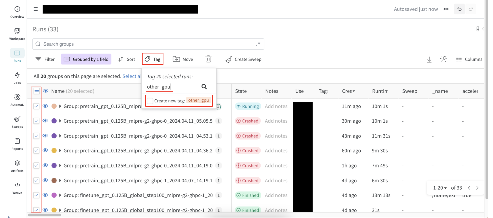 | 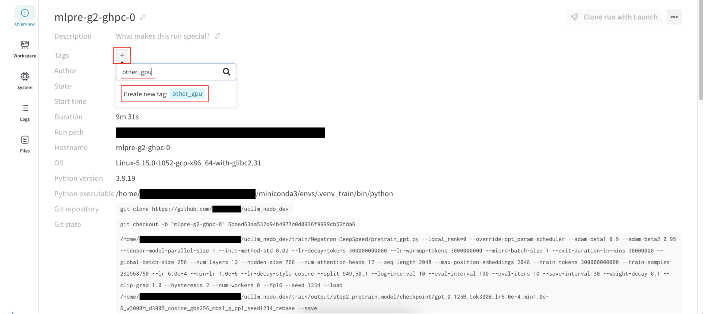 |

### Step 2-3. 事前学習のW&Bロギングの確認

マルチノード分散学習時の事前学習のW&Bロギングは、下図のように1つのW&B groupの中に各ノードに対応するW&B runが作成されます (下図は2ノードの場合の例) 。
W&B group名の中には、親ノードのホスト名 (下図で赤色の下線が引かれている箇所) が記載されていますので、どのW&B runが親ノードのものかわかるようになっています。

やり方: <br/>
1. Filterボタン (ファネルのようなアイコン) の右隣にあるGroupボタン (下図で薄紫色になっている四角形のアイコン) を押下
2. ドロップダウンリストの中から "Group" という項目 (注意: "Grouped run" という項目ではありません) を選択
3. W&B group名の先頭にあるToggleボタン (三角形のアイコン) を押下し、そのW&B groupの中に各ノードに対応するW&B runが入っていることを確認

参考リンク: <br/>
* https://docs.wandb.ai/ja/guides/runs/grouping#%E3%82%B0%E3%83%AB%E3%83%BC%E3%83%97%E5%8C%96%E3%82%92%E7%94%A8%E3%81%84%E3%81%9F%E5%88%86%E6%95%A3%E3%83%88%E3%83%AC%E3%83%BC%E3%83%8B%E3%83%B3%E3%82%B0

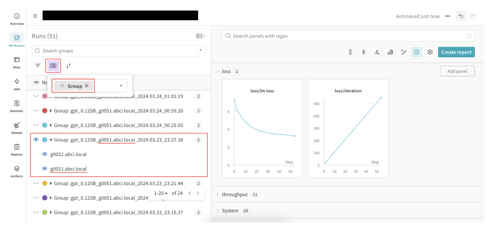

※マルチノード分散学習時の事前学習においては、Training metrics (例: loss) とSystem metrics (例: GPU使用率) の両方とも全ノードでロギングされますが、Training metricsについてはどのノードでも共通で同じ内容がロギングされます。
**ですので事前学習においては、Training metricsはどのノードのW&B runを見ても構いません。**

|  | Training metrics | System metrics |
| :---: | :---: | :---: |
| node1 | 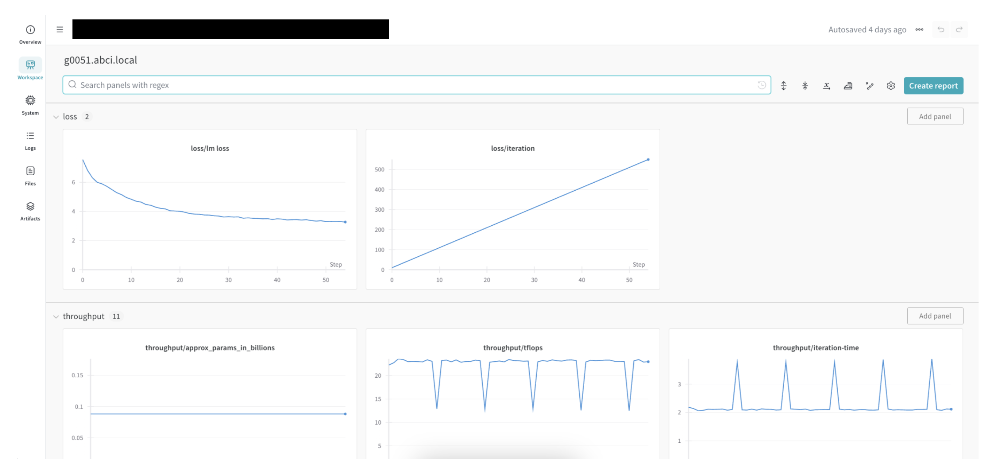 | 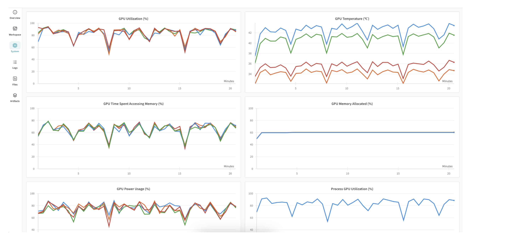 |
| node2 | 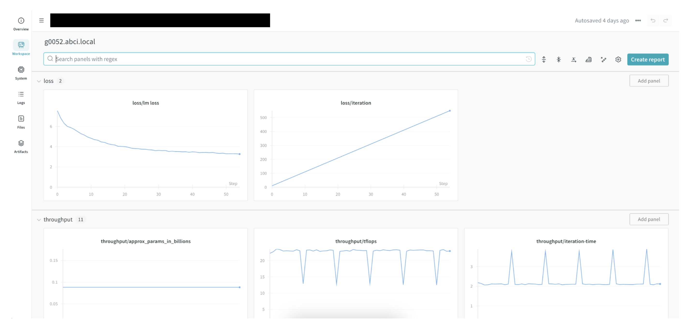 | 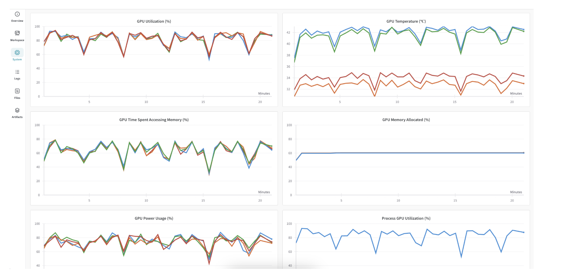 |

### Step 2. でのトラブルシューティング

##### 1. "ImportError: cannot import name 'helpers' from 'megatron.data' (Megatron-DeepSpeed/megatron/data/__init__.py)" というエラーが出た場合

原因: <br/>
`~/ucllm_nedo_dev/train/Megatron-DeepSpeed/megatron/data/helpers.cpython-39-x86_64-linux-gnu.so` が正しく作成されていないことが原因と考えられます。

解決策: <br/>
`~/ucllm_nedo_dev/train/Megatron-DeepSpeed/megatron/data/Makefile` 内に記載されている `python3-config` のパスを `$ which python3-config` で出力された絶対パスに変更してから、 `~/ucllm_nedo_dev/train/Megatron-DeepSpeed/megatron/data/` にて `make` コマンドを実行してみて下さい。

```sh
# python3-configの絶対パスを確認。
(.venv_train) $ which python3-config

# ~/ucllm_nedo_dev/train/Megatron-DeepSpeed/megatron/data/Makefileのpython3-configのパスを、上記のwhichコマンドで出力された絶対パスに変更。
(.venv_train) $ vim ~/ucllm_nedo_dev/train/Megatron-DeepSpeed/megatron/data/Makefile
"""
# Before
LIBEXT = $(shell python3-config --extension-suffix)

# After
LIBEXT = $(shell /absolute/path/to/python3-config --extension-suffix)
"""

# ~/ucllm_nedo_dev/train/Megatron-DeepSpeed/megatron/data/にてmakeコマンドを実行。
(.venv_train) $ cd ~/ucllm_nedo_dev/train/Megatron-DeepSpeed/megatron/data/ && make

# helpers.cpython-39-x86_64-linux-gnu.soが作成されていることを確認。
(.venv_train) $ find ~/ucllm_nedo_dev/train/Megatron-DeepSpeed/megatron/data/ -name helpers.cpython-39-x86_64-linux-gnu.so
```

参考リンク: <br/>
* https://zenn.dev/turing_motors/articles/04c1328bf6095a#pyenv-virtualenv-%E3%82%92%E4%BD%BF%E3%81%86%E3%81%A8%E5%BF%85%E8%A6%81%E3%81%AB%E3%81%AA%E3%82%8B%E5%87%A6%E7%90%86
* https://zenn.dev/turing_motors/articles/da7fa101ecb9a1#makefile%E3%81%AE%E6%9B%B8%E3%81%8D%E6%8F%9B%E3%81%88

#### 2. 事前学習スクリプトが "> compiling and loading fused kernels ..." というところでスタックした場合

原因: <br/>
既存の `~/ucllm_nedo_dev/train/Megatron-DeepSpeed/megatron/fused_kernels/build/` が作成された当時と現在でハードウェアやCUDAのバージョンが異なっていることが原因と考えられます。

解決策: <br/>
`~/ucllm_nedo_dev/train/Megatron-DeepSpeed/megatron/fused_kernels/build/` を削除してから、もう一度事前学習スクリプトを実行してみて下さい。

```sh
# ~/ucllm_nedo_dev/train/Megatron-DeepSpeed/megatron/fused_kernels/build/を削除。
(.venv_train) $ rm -rf ~/ucllm_nedo_dev/train/Megatron-DeepSpeed/megatron/fused_kernels/build/
```

参考リンク: <br/>
* https://github.com/NVIDIA/Megatron-LM/issues/82#issuecomment-1613749424

## Step 3. 事前学習済みモデルのアップロード

### Step 3-1. トークナイザーと事前学習済みモデルのHuggingFace Transformers形式への変換

```sh
(.venv_train) $ cd ~/ucllm_nedo_dev/train/scripts/step3_upload_pretrained_model/

# 変換スクリプトを実行。
# ${YOUR_MODEL_SEQUENCE_LENGTH} は、事前学習スクリプトで設定した sequence length/context window と同じ値 (例: 2048) に設定。
(.venv_train) $ bash ./convert_tokenizer_and_pretrained_model_to_huggingface_transformers.sh \
    --input_tokenizer_file ~/ucllm_nedo_dev/train/output/step1_train_tokenizer/${YOUR_TOKENIZER_NAME}/${YOUR_TOKENIZER_NAME}.model \
    --input_model_max_length ${YOUR_MODEL_SEQUENCE_LENGTH} \
    --input_model_dir ~/ucllm_nedo_dev/train/output/step2_pretrain_model/checkpoint/gpt_0.125B_${YOUR_JOB_NAME}/global_step1000/ \
    --output_tokenizer_and_model_dir ~/ucllm_nedo_dev/train/output/step3_upload_pretrained_model/gpt_0.125B_global_step1000/
```

### Step 3-2. トークナイザーと事前学習済みモデルのHuggingFace Hubへのアップロード

```sh
(.venv_train) $ cd ~/ucllm_nedo_dev/train/scripts/step3_upload_pretrained_model/

# HuggingFaceにログイン。
# https://huggingface.co/settings/tokens --> 書き込み権限ありのAPIキーをコピペ。
(.venv_train) $ huggingface-cli login

# HuggingFaceにログインしていることを確認。
(.venv_train) $ huggingface-cli whoami

# アップロードスクリプトを実行。
(.venv_train) $ python ./upload_tokenizer_and_pretrained_model_to_huggingface_hub.py \
    --input_tokenizer_and_model_dir ~/ucllm_nedo_dev/train/output/step3_upload_pretrained_model/gpt_0.125B_global_step1000/ \
    --output_model_name gpt_0.125B_global_step1000 \
    --test_prompt_text "Once upon a time,"
```

## Step 4. モデルのファインチューニング

### Step 4-1. ABCIでマルチノード分散学習を行うための下準備

```sh
(.venv_train) $ cd ~/ucllm_nedo_dev/train/scripts/common/

# 親ノードが各ノードにパスフレーズなしでSSHアクセスできるように設定する~/.ssh/configファイルを作成。
# (deepspeedランチャーを用いてマルチノード分散学習を行うには、親ノードが子ノード達にパスフレーズなしでSSHアクセスできるようにする必要があるため)
(.venv_train) $ bash ./create_ssh_config_file_for_gcp_play_multi_node_multi_gpu.sh
```

### Step 4-2. ファインチューニングの実行

```sh
(.venv_train) $ cd ~/ucllm_nedo_dev/train/scripts/step4_finetune_model/

# ファインチューニングスクリプトを実行。 (GENIACで提供しているGPU使用時にW&Bアカウントを用いる場合は `--wandb_tag` オプションを付ける必要はない)
(.venv_train) $ bash ./gcp_honban_node-2_gpu-16/dataset-openassistant/launcher-deepspeed_zero-3.sh \
    --input_model_name_or_path ${YOUR_HUGGINGFACE_USER_NAME}/gpt_0.125B_global_step1000 \
    --input_max_seq_length ${YOUR_MODEL_SEQUENCE_LENGTH} \
    --output_tokenizer_and_model_dir ~/ucllm_nedo_dev/train/output/step4_finetune_model/gpt_0.125B_global_step1000_openassistant/ \
    --wandb_entity ${YOUR_WANDB_ENTITY_OR_TEAM_NAME} \
    --wandb_project ${YOUR_WANDB_PROJECT_NAME}

# ファインチューニングスクリプトを実行。 (GENIACで提供していないGPU使用時にW&Bアカウントを用いる場合は `--wandb_tag other_gpu` を付ける必要がある)
(.venv_train) $ bash ./gcp_honban_node-2_gpu-16/dataset-openassistant/launcher-deepspeed_zero-3.sh \
    --input_model_name_or_path ${YOUR_HUGGINGFACE_USER_NAME}/gpt_0.125B_global_step1000 \
    --input_max_seq_length ${YOUR_MODEL_SEQUENCE_LENGTH} \
    --output_tokenizer_and_model_dir ~/ucllm_nedo_dev/train/output/step4_finetune_model/gpt_0.125B_global_step1000_openassistant/ \
    --wandb_entity ${YOUR_WANDB_ENTITY_OR_TEAM_NAME} \
    --wandb_project ${YOUR_WANDB_PROJECT_NAME} \
    --wandb_tag other_gpu
```

※W&Bタグは、W&BサイトのウェブUIから後付けすることも可能です。

参考リンク: <br/>
* https://docs.wandb.ai/ja/guides/app/features/tags#%E3%82%BF%E3%82%B0%E3%81%AE%E8%BF%BD%E5%8A%A0%E6%96%B9%E6%B3%95

| Project page から後付けする方法 | Run page から後付けする方法 |
| :---: | :---: |
|  |  |

### Step 4-3. ファインチューニングのW&Bロギングの確認

マルチノード分散学習時のファインチューニングのW&Bロギングは、下図のように1つのW&B groupの中に各ノードに対応するW&B runが作成されます (下図は2ノードの場合の例) 。
W&B group名の中には、親ノードのホスト名 (下図で赤色の下線が引かれている箇所) が記載されていますので、どのW&B runが親ノードのものかわかるようになっています。

やり方: <br/>
1. Filterボタン (ファネルのようなアイコン) の右隣にあるGroupボタン (下図で薄紫色になっている四角形のアイコン) を押下
2. ドロップダウンリストの中から "Group" という項目 (注意: "Grouped run" という項目ではありません) を選択
3. W&B group名の先頭にあるToggleボタン (三角形のアイコン) を押下し、そのW&B groupの中に各ノードに対応するW&B runが入っていることを確認

参考リンク: <br/>
* https://docs.wandb.ai/ja/guides/runs/grouping#%E3%82%B0%E3%83%AB%E3%83%BC%E3%83%97%E5%8C%96%E3%82%92%E7%94%A8%E3%81%84%E3%81%9F%E5%88%86%E6%95%A3%E3%83%88%E3%83%AC%E3%83%BC%E3%83%8B%E3%83%B3%E3%82%B0

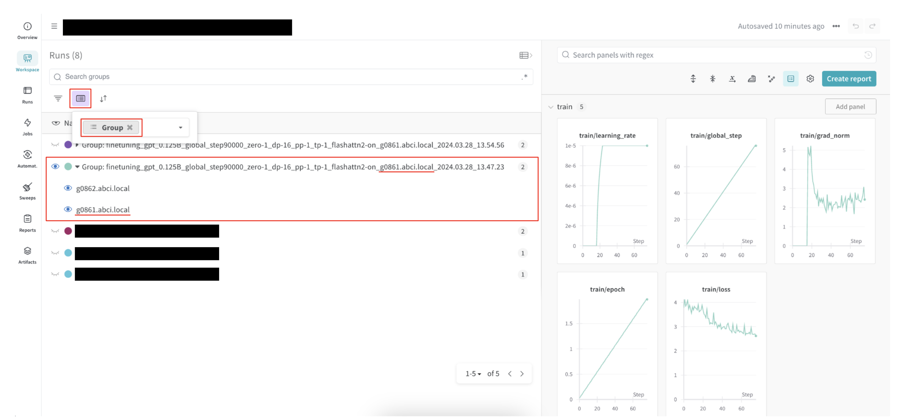

※マルチノード分散学習時のファインチューニングにおいては、Training metrics (例: loss) は親ノードのみでロギングされ、System metrics (例: GPU使用率) は全ノードでロギングされます。
**ですのでファインチューニングにおいては、Training metricsは親ノードのW&B runを見る必要があります (親ノードのホスト名はW&B group名に記載されています) 。**

|  | Training metrics | System metrics |
| :---: | :---: | :---: |
| node1 | 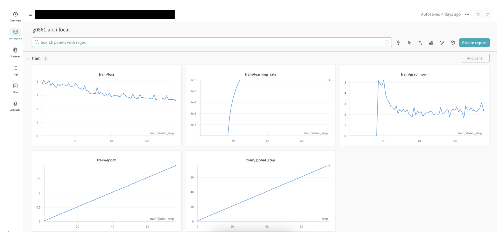 | 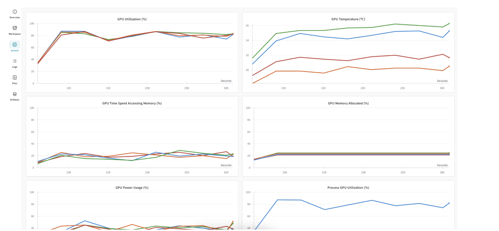 |
| node2 | 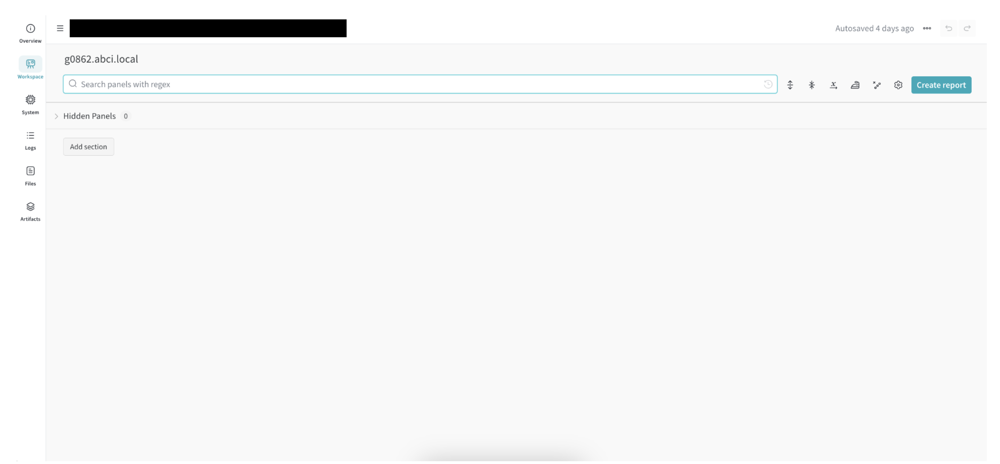 | 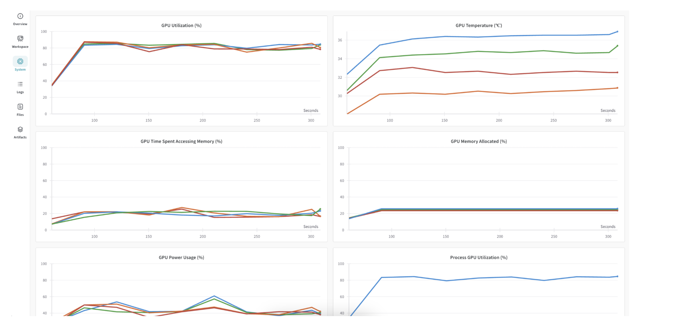 |

## Step 5. ファインチューニング済みモデルのアップロード

### Step 5-1. トークナイザーとファインチューニング済みモデルのHuggingFace Hubへのアップロード

```sh
(.venv_train) $ cd ~/ucllm_nedo_dev/train/scripts/step5_upload_finetuned_model/

# HuggingFaceにログインしていることを確認。
(.venv_train) $ huggingface-cli whoami

# アップロードスクリプトを実行。
(.venv_train) $ python ./upload_tokenizer_and_finetuned_model_to_huggingface_hub.py \
    --input_tokenizer_and_model_dir ~/ucllm_nedo_dev/train/output/step4_finetune_model/gpt_0.125B_global_step1000_openassistant/ \
    --output_model_name gpt_0.125B_global_step1000_openassistant \
    --test_prompt_text "Once upon a time,"
```
